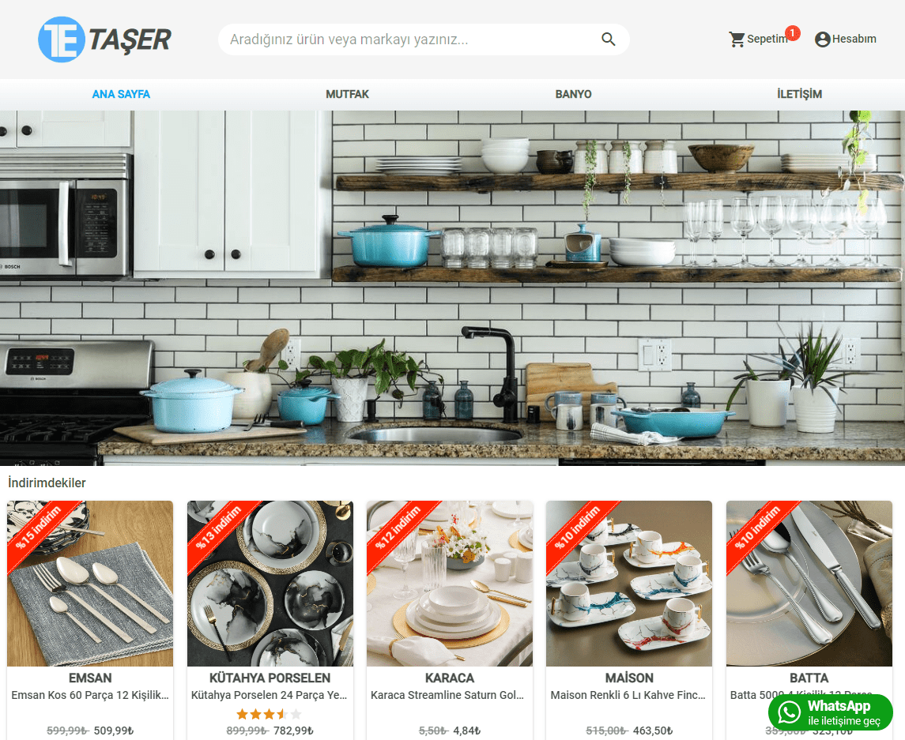
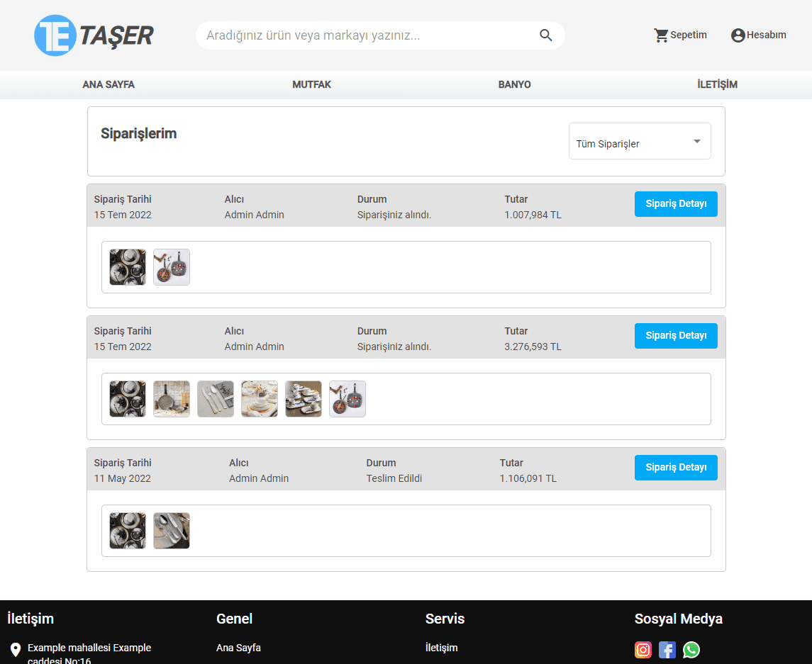
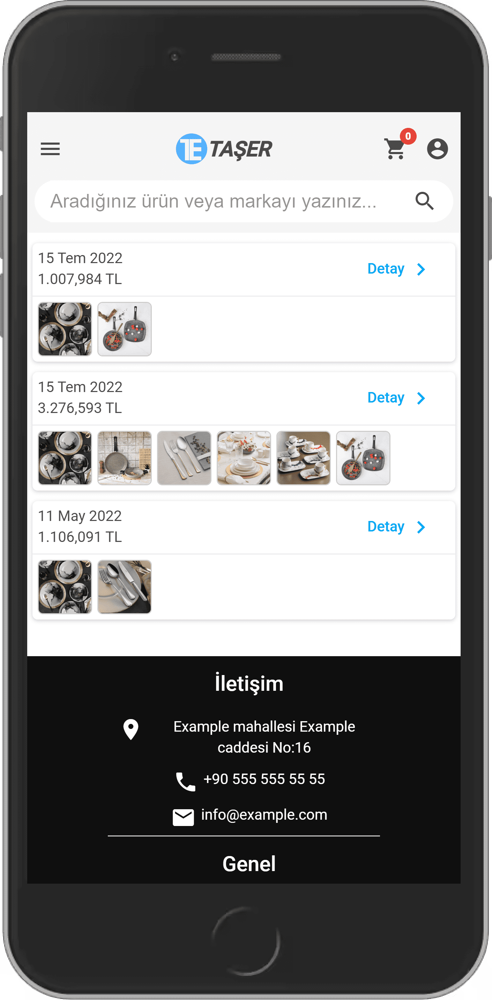
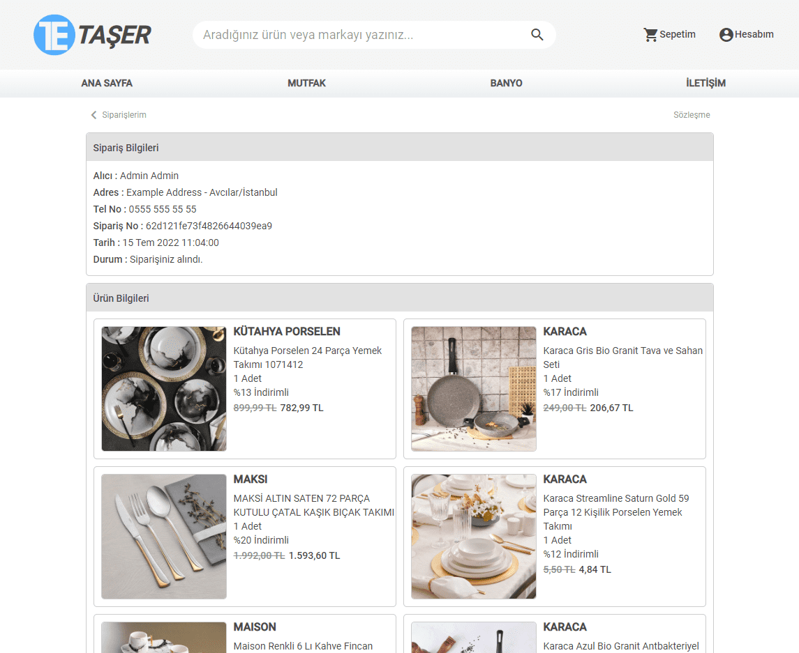
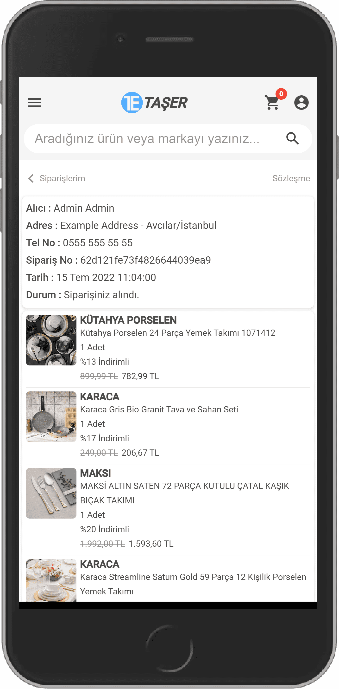

# Description

This is fullstack e commerce application. This project developed using Angular and NodeJS.

# Technologies

- NodeJs
- Angular
- Angular Material - UI Library
- ExpressJs - The Node.js web application framework
- Mongoose - MongoDB ODM
- Socket.io - Used for live data
- Nodemailer - Send e-mails from Node.js
- Angularx-social-login - Front-end framework for Google Auth
- Iyzipay - Payment System
- Cloudinary - Photo Storage Cloud
- Sharp - Compression and change resolution of uploaded photos  

# How to run
### NOTE : You need to have Angular CLI and NodeJS before run it.

Clone project. Open with editor. Firstly run back-end with following commands
```
cd ./back-end
npm install
npm run start
```
Back-end running now. Open new terminal for front-end and run following commands
```
cd ./front-end
npm install
ng serve -o
```
You can use this admin account => `dev@dev.com/123456` for see admin panel too.

# How to use it for different projects
### Back-end 
You can add your env file under env folder at back-end directory and change to ENV value at main.js file under back-end directory. 
### Front-end
You need change variables under `src/evironments/` and `src/assets/config/prod/` directories.

# Screenshots

## Main
&nbsp;<br>



<!--  -->
&nbsp;<br>
&nbsp;<br>
&nbsp;<br>

## Orders
&nbsp;<br>


<!--  -->

&nbsp;<br>
&nbsp;<br>
&nbsp;<br>

## Order Detail
&nbsp;<br>


<!--  -->

